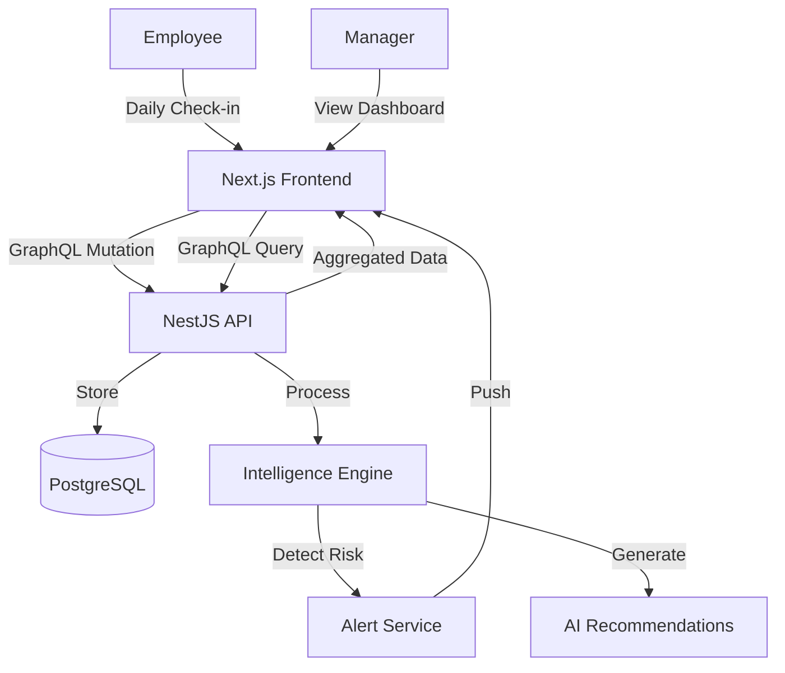

# Resonance MVP Implementation Plan

## Architecture Overview

**Tech Stack:**

- **Frontend:** Next.js 14 (App Router), React, TailwindCSS, Framer Motion, Zustand, Recharts
- **Backend:** NestJS with GraphQL (Apollo)
- **Database:** PostgreSQL with Prisma ORM
- **Auth:** Auth.js (NextAuth) with JWT
- **AI:** OpenAI API for recommendations
- **Infrastructure:** Vercel (frontend), Railway/Supabase (backend + DB)

**Project Structure:**

```
Resoance/
├── apps/
│   ├── web/          # Next.js frontend
│   └── api/          # NestJS backend
├── packages/
│   ├── shared/       # Shared types, utilities
│   └── prisma/       # Prisma schema & client
├── package.json      # Root workspace config
└── pnpm-workspace.yaml
```

## Implementation Phases

### Phase 1: Project Setup & Foundation

**1.1 Monorepo Setup**

- Initialize pnpm workspace
- Configure TypeScript, ESLint, Prettier
- Set up shared package structure
- Configure path aliases

**1.2 Database Schema** (`packages/prisma/schema.prisma`)

- User model (id, name, email, role, orgId, createdAt)
- Organization model (id, name, settings)
- EmotionalEntry model (id, userId, moodScore, energyScore, stressScore, note, timestamp)
- TeamMetrics model (id, orgId, avgMood, burnoutIndex, engagementIndex, period)
- Alert model (id, orgId, userId, type, severity, message, resolved, createdAt)
- UserOrganization join table for multi-org support

**1.3 Prisma Setup**

- Generate Prisma client
- Create migration scripts
- Seed script for development

### Phase 2: Authentication System

**2.1 Auth.js Configuration** (`apps/web/app/api/auth/[...nextauth]/route.ts`)

- Configure NextAuth with JWT strategy
- Set up database adapter (Prisma)
- Implement role-based access control (Employee, Manager, Admin)
- Create auth middleware for protected routes

**2.2 Auth UI Components** (`apps/web/components/auth/`)

- Login page
- Signup page
- Protected route wrapper
- User profile dropdown

### Phase 3: Backend API (NestJS + GraphQL)

**3.1 Core Modules** (`apps/api/src/`)

- GraphQL module setup (Apollo Server)
- Prisma service for database access
- Auth guard (JWT validation)
- Role decorator (Employee, Manager, Admin)

**3.2 GraphQL Schema** (`apps/api/src/schema.graphql`)

- User type, EmotionalEntry type, TeamMetrics type, Alert type
- Queries: me, myTrends, teamHeatmap, teamAlerts, teamCorrelations
- Mutations: createCheckin, updateProfile

**3.3 Resolvers**

- `UserResolver` - user profile queries
- `EmotionalEntryResolver` - check-in mutations and queries
- `TeamResolver` - manager dashboard queries
- `AlertResolver` - alert management

**3.4 Services**

- `EmotionalEntryService` - CRUD operations, trend calculations
- `TeamMetricsService` - aggregation, heatmap generation
- `RiskDetectionService` - burnout detection, anomaly detection
- `RecommendationService` - AI-powered suggestions

### Phase 4: Employee Companion App

**4.1 Onboarding Flow** (`apps/web/app/onboarding/`)

- Welcome screen
- Role selection
- Organization join/create
- Profile setup

**4.2 Daily Check-in** (`apps/web/app/checkin/`)

- Emoji mood selector (5-7 options)
- Energy level slider (0-100)
- Stress level slider (0-100)
- Optional note textarea
- Submit mutation to GraphQL API

**4.3 Employee Dashboard** (`apps/web/app/dashboard/`)

- Today's mood card
- Weekly trend chart (Recharts)
- Burnout risk meter (visual indicator)
- Recent check-ins list
- Quick stats (streak, avg mood)

**4.4 Trends Page** (`apps/web/app/trends/`)

- Monthly mood timeline
- Energy vs Stress correlation chart
- Pattern insights (AI-generated)
- Export functionality

**4.5 Journal Page** (`apps/web/app/journal/`)

- List of check-in notes
- Search/filter by date
- Mood tags visualization

### Phase 5: Manager Dashboard

**5.1 Team Overview** (`apps/web/app/manager/dashboard/`)

- Team emotional heatmap (color-coded grid)
- Time period selector (daily/weekly/monthly)
- Key metrics cards (avg mood, burnout risk, engagement)

**5.2 Alerts Page** (`apps/web/app/manager/alerts/`)

- Alert list with severity badges
- Filter by type (burnout, disengagement, anomaly)
- Resolve/mark as read functionality
- Real-time updates

**5.3 Correlations Page** (`apps/web/app/manager/correlations/`)

- Emotional state vs performance graphs
- Interactive charts (Recharts)
- Time range selector
- Export reports

**5.4 Recommendations Feed** (`apps/web/app/manager/recommendations/`)

- AI-generated intervention suggestions
- Priority sorting
- Action buttons (dismiss, implement)
- Historical recommendations

### Phase 6: Intelligence Layer

**6.1 Emotional Signal Engine** (`apps/api/src/services/emotional-signal.service.ts`)

- Normalize mood/energy/stress scores
- Calculate composite emotional index
- Generate mood categories (thriving, stable, struggling, at-risk)

**6.2 Pattern Detection** (`apps/api/src/services/pattern-detection.service.ts`)

- Trend analysis (improving/declining)
- Anomaly detection (sudden drops)
- Weekly pattern recognition
- Burnout signal aggregation

**6.3 Risk Detection Service** (`apps/api/src/services/risk-detection.service.ts`)

- Burnout probability calculation (rule-based + regression)
- Disengagement signals (low check-in frequency, declining mood)
- Team-level risk aggregation
- Alert generation logic

**6.4 Recommendation Engine** (`apps/api/src/services/recommendation.service.ts`)

- OpenAI API integration
- Context building (team metrics, trends, alerts)
- Prompt engineering for actionable suggestions
- Caching for cost optimization

### Phase 7: UI/UX Implementation

**7.1 Design System** (`apps/web/styles/`)

- TailwindCSS configuration
- Custom color palette (cyber-wellness theme)
- Neon accent colors
- Typography scale
- Component variants

**7.2 Shared Components** (`apps/web/components/ui/`)

- Button, Card, Input, Slider, Badge
- Modal, Dropdown, Tabs
- Loading states, Empty states
- Error boundaries

**7.3 Animations** (`apps/web/components/animations/`)

- Framer Motion transitions
- Page transitions
- Micro-interactions
- Loading skeletons

**7.4 Responsive Design**

- Mobile-first approach
- Tablet and desktop breakpoints
- Touch-friendly interactions

### Phase 8: State Management

**8.1 Zustand Stores** (`apps/web/stores/`)

- `authStore` - user session, role
- `checkinStore` - check-in state, submission
- `dashboardStore` - dashboard data, filters
- `alertStore` - real-time alerts

**8.2 React Query** (`apps/web/lib/react-query/`)

- GraphQL query hooks
- Mutation hooks
- Cache configuration
- Optimistic updates

### Phase 8: Integration & Polish

**8.1 Real-time Updates**

- WebSocket or polling for alerts
- Live dashboard updates
- Notification system

**8.2 Error Handling**

- Global error boundary
- API error handling
- User-friendly error messages
- Retry logic

**8.3 Performance Optimization**

- Code splitting
- Image optimization
- GraphQL query optimization
- Database indexing

**8.4 Privacy Features**

- Data anonymization for managers
- Aggregation logic
- Privacy settings page
- Data export/deletion

## Key Files to Create

### Backend

- `apps/api/src/main.ts` - NestJS bootstrap
- `apps/api/src/app.module.ts` - Root module
- `apps/api/src/graphql/graphql.module.ts` - GraphQL configuration
- `apps/api/src/prisma/prisma.service.ts` - Database service
- `apps/api/src/auth/auth.guard.ts` - JWT guard
- `apps/api/src/resolvers/*.resolver.ts` - GraphQL resolvers
- `apps/api/src/services/*.service.ts` - Business logic

### Frontend

- `apps/web/app/layout.tsx` - Root layout
- `apps/web/app/(auth)/login/page.tsx` - Login page
- `apps/web/app/(employee)/dashboard/page.tsx` - Employee dashboard
- `apps/web/app/(employee)/checkin/page.tsx` - Check-in page
- `apps/web/app/(manager)/dashboard/page.tsx` - Manager dashboard
- `apps/web/components/checkin/MoodSelector.tsx` - Mood input
- `apps/web/components/dashboard/Heatmap.tsx` - Team heatmap
- `apps/web/lib/graphql/client.ts` - Apollo Client setup

### Shared

- `packages/shared/src/types/index.ts` - Shared TypeScript types
- `packages/shared/src/utils/index.ts` - Utility functions

## Data Flow



## Success Criteria

- Employees can complete daily check-ins in <30 seconds
- Manager dashboard loads in <2 seconds
- Burnout alerts trigger within 24 hours of risk signals
- AI recommendations are actionable and relevant
- All data is anonymized for manager views
- Mobile-responsive on all screens
- Zero privacy violations (no individual emotion sharing)

## Next Steps After MVP

- Performance metrics integration (Jira, Linear, etc.)
- Advanced ML models for prediction
- Team collaboration features
- Mobile apps (React Native)
- Advanced analytics and reporting